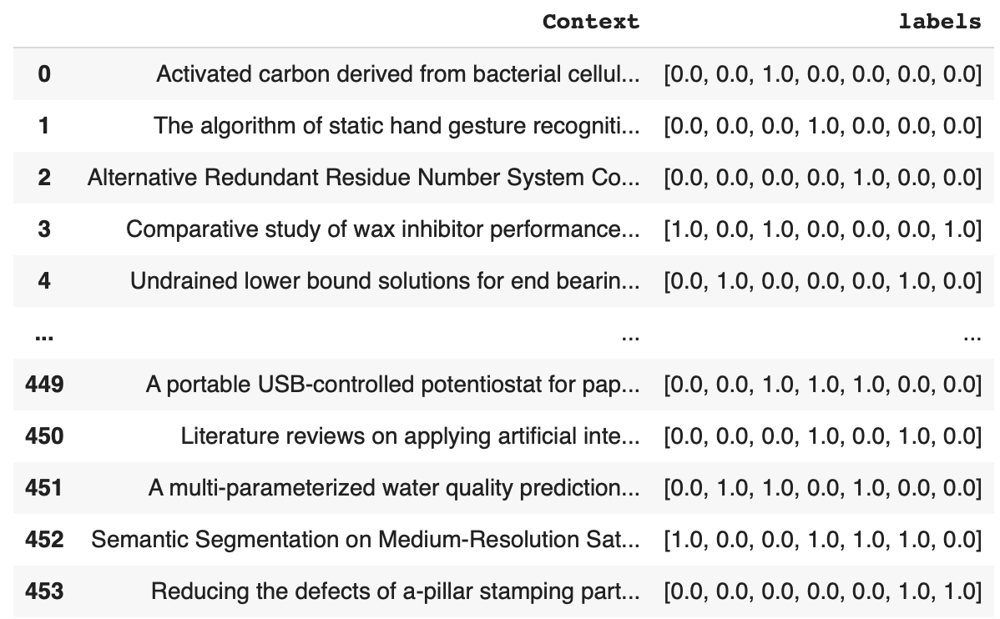
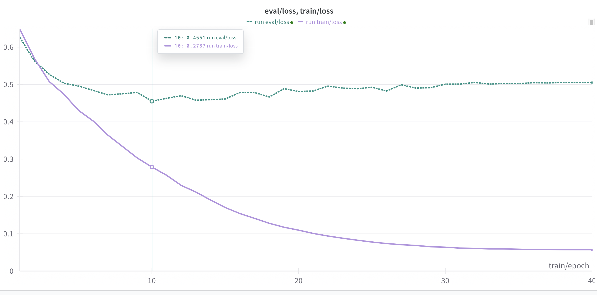

# Multi-Label text classification for Scopus Publications using encoder representation from transformers language model (RoBERTa)


[credit image](https://towardsdatascience.com/deconstructing-bert-part-2-visualizing-the-inner-workings-of-attention-60a16d86b5c1)


## Motivation
To experiment with how the concept of transfer learning, in terms of using an encoder-based transformer pretrained model (RoBERTa in this case), fine-tuned with the Scopus publication dataset, can improve the text classification performance of the model


## Resource
- **datasets**: Full Raw Scopus Dataset: Resource from 2110531 Data Science and Data Engineering Tools, semester 1/2023, Chulalongkorn University, with the support of the CU Office of Academic Resources (2018 - 2023)

- **Encoder Transformer Model**: [RoBERTa](https://arxiv.org/pdf/1907.11692.pdf)

## Statical Metric Using

- The **F1 macro score** provides an overall measure of the model's performance across all labels, treating each label equally


## Methodology

[](https://colab.research.google.com/drive/1P2SevookxKc8DmCGicD5FFsdFXFVevYb?usp=sharing)

### I) Install required packages and import important libaries 

```py

#===============Install required packages =====================#

!pip install transformers[torch] datasets evaluate scipy wandb

#================Import Libaries===============================#
# Data processing
import numpy as np

# Modeling

from transformers import RobertaTokenizer, RobertaForSequenceClassification, TrainingArguments, Trainer, EarlyStoppingCallback, TextClassificationPipeline

# Hugging Face Dataset
from datasets import Dataset

# Model performance evaluation
from sklearn import metrics

#for train, validate spliting
from sklearn.model_selection import train_test_split

from sklearn.preprocessing import MultiLabelBinarizer

import seaborn as sns
import matplotlib.pyplot as plt
import wandb
import tqdm


```
### II) Prepare data for the model

<details><summary>Data Importing & Preprocessing</summary>

```python
  
#clone dataset storing in git repo
! git clone https://github.com/RadchaneepornC/ClassificationScopusPaper

 #import dataset as DataFrame
import pandas as pd
df_train = pd.read_json("/content/ClassificationScopusPaper/dataset/train_student.json")
print(df_train)

df_test = pd.read_json("/content/ClassificationScopusPaper/dataset/test_student.json")
print(df_test)

#Transpose Data with ```.T``` attribute to swap column and row axis
df_train = df_train.T
df_test = df_test.T

print(df_train.head())
print(df_test.head())

#combline content in the column name Title and Abstract and assign as new column name Context
df_train["Context"]=df_train["Title"]+'.'+df_train["Abstract"]
df_test["Context"]=df_test["Title"]+'.'+df_test["Abstract"]

#drop the old column after combline them
df_train.drop(columns=['Title','Abstract'], inplace = True)
df_test.drop(columns=['Title','Abstract'], inplace = True)

#reset index and drop the old index column
df_train=df_train.reset_index()
df_train.drop(columns=['index'], inplace =True)
df_test.reset_index(inplace = True, drop = True)

#rearrange position of the column
df_train = df_train[["Context","Classes"]]

```

</details>

<details><summary>Label Encoding</summary>

```python

#Initial binarizer named MultiLabelBinarizer from scikit-learn library to encode the multi-label class
mlb = MultiLabelBinarizer(sparse_output=False)

#Encode the classes by fitting the MultiLabelBinarizer on the 'Classes' column and transforming thr classes into a binary matrix, this return encoded matrix
encoder_train = mlb.fit_transform(df_train["Classes"])
encoder_test = mlb.fit_transform(df_test["Classes"])

#Convert encoded matrices to DataFrame
encoder_train = pd.DataFrame(encoder_train, columns = mlb.classes_ )
encoder_test = pd.DataFrame(encoder_test, columns = mlb.classes_ )

#Join Encoded DataFrame with original DataFrame
df_train = df_train.join(encoder_train)
df_test = df_test.join(encoder_test)

#create new column named labels storing the label encode list converted from encode class
df_train['labels'] = df_train[mlb.classes_].values.tolist()
df_test['labels'] = df_test[mlb.classes_].values.tolist()

#drop the old label columns
df_train = df_train.drop(columns = ['Classes','AUTO', 'CE', 'CHE', 'CPE', 'EE', 'IE', 'ME'])
df_test = df_test.drop(columns = ['Classes','AUTO', 'CE', 'CHE', 'CPE', 'EE', 'IE', 'ME'])

#convert 'labels' Column value from Int to Float type
def inttofloat(x):
return list(np.float_(x))
df_train['labels'] = df_train['labels'].apply(lambda x : inttofloat(x))
df_test['labels'] = df_test['labels'].apply(lambda x : inttofloat(x))
```

now the data is in this form



</details>
<details><summary>Data Splitting</summary>

```python
#split the data of train set in to train and validate data with the ration 80:20, use random_'state'to ensure reproducibility
df_train, df_validate = train_test_split(df_train, test_size=0.2,random_state=42)

#reset index and drop the old index
df_train = df_train.reset_index(drop = True)
df_validate = df_validate.reset_index(drop = True)

#create huggindface arrow dataset from pandas DataFrame 
hg_train = Dataset.from_pandas(df_train)
hg_valid = Dataset.from_pandas(df_validate)
hg_test = Dataset.from_pandas(df_test)
```

Note: **Arrow dataset format** is a binary format optimized for efficient storage and processing within the Hugging Face framework, below is the example of arrow dataset structured

```python

import datasets

# Create an Arrow dataset
dataset = datasets.Dataset.from_dict(
    {
        "id": [1, 2, 3],
        "text": ["This is the first line.", "This is the second line.", "This is the third line."],
        "label": ["positive", "negative", "neutral"]
    }
)

# Access data in the Arrow dataset
print(dataset[0])  # {"id": 1, "text": "This is the first line.", "label": "positive"}
print(dataset["text"][1])  # "This is the second line

```

</details>


<details><summary>Initialize the tokenizer</summary>

This tokenizer is responsible for preprocessing the text data into a format that can be fed into the model
  
  ```python

#Download tokenizer
from transformers import RobertaTokenizer
tokenizer = RobertaTokenizer.from_pretrained("roberta-base")

# Funtion to tokenize data
def tokenize_dataset(data):
    return tokenizer(data["Context"],
                     max_length=512,
                     truncation=True,
                     padding="max_length")

# Tokenize the dataset
dataset_train = hg_train.map(tokenize_dataset)
dataset_valid = hg_valid.map(tokenize_dataset)
dataset_test = hg_test.map(tokenize_dataset)


```

Note If we take a look at tokenizer, its inside be like this 

```
RobertaTokenizer(name_or_path='roberta-base', vocab_size=50265, model_max_length=512, is_fast=False, padding_side='right', truncation_side='right', special_tokens={'bos_token': '<s>', 'eos_token': '</s>', 'unk_token': '<unk>', 'sep_token': '</s>', 'pad_token': '<pad>', 'cls_token': '<s>', 'mask_token': '<mask>'}, clean_up_tokenization_spaces=True),  added_tokens_decoder={
	0: AddedToken("<s>", rstrip=False, lstrip=False, single_word=False, normalized=True, special=True),
	1: AddedToken("<pad>", rstrip=False, lstrip=False, single_word=False, normalized=True, special=True),
	2: AddedToken("</s>", rstrip=False, lstrip=False, single_word=False, normalized=True, special=True),
	3: AddedToken("<unk>", rstrip=False, lstrip=False, single_word=False, normalized=True, special=True),
	50264: AddedToken("<mask>", rstrip=False, lstrip=True, single_word=False, normalized=False, special=True),
}
```

if we print the ```dataset_train```, ```dataset_valid```, ```dataset_test``` the structure inside them will be like this

```
ataset({
    features: ['Context', 'labels', 'input_ids', 'attention_mask'],
    num_rows: 363
})
Dataset({
    features: ['Context', 'labels', 'input_ids', 'attention_mask'],
    num_rows: 91
})
Dataset({
    features: ['Context', 'labels', 'input_ids', 'attention_mask'],
    num_rows: 151
})
```

- **input_ids**:  are the integer representations of the tokens based on the tokenizer's vocabulary after our input text is split into tokens by tokenizer, the ```input_ids``` stored as a tensor or a list 

- **attention_mask**: is the tensor or a list indicating which tokens should be attended to and which ones should be ignored, it has the same length as the input IDs


</details>

<details><summary>Create Custom dataset</summary>
<br>
this process used for combining the tokenized encodings with the corresponding labels

**Processes occured within this step:**
1. **The ```MultiLabelDataset``` class is defined as a subclass of ```torch.utils.data.Dataset```**

- The ```__init__``` method takes the tokenized encodings and labels as input and stores them as instance variables.
- The ```__getitem__``` method is called when accessing an item in the dataset by index. It retrieves the tokenized encodings and labels for the specified index and converts them to PyTorch tensors.
- The ```__len__``` method returns the length of the dataset, which is the number of samples.

2. **The tokenized datasets (```dataset_train```, ```dataset_valid```, ```dataset_test```) and the corresponding labels (```df_train['labels'].tolist()```, ```df_validate['labels'].tolist()```, ```df_test['labels'].tolist()```) are passed to the ```MultiLabelDataset``` class to create instances of the custom dataset**

- The tokenized encodings contain the ```input IDs```, ```attention masks```, and other relevant information obtained from the tokenization process
- The labels are typically stored in a separate dataframe or list and are passed as the second argument to the ```MultiLabelDataset``` constructor

3. **The MultiLabelDataset instances (```train_dataset```, ```valid_dataset```, ```test_dataset```) are created by passing the respective tokenized encodings and labels**

These instances represent the complete dataset, combining the tokenized encodings with their corresponding labels in a single object


```python

import torch
class MultiLabelDataset(torch.utils.data.Dataset):
    def __init__(self, encodings, labels):
        self.encodings = encodings
        self.labels = labels

    def __getitem__(self, idx):
        item = {key: torch.tensor(self.encodings[key][idx]) for key in ['input_ids', 'attention_mask']}
        item['labels'] = torch.tensor(self.labels[idx])
        return item

    def __len__(self):
        return len(self.labels)

train_dataset = MultiLabelDataset(dataset_train, df_train['labels'].tolist())
valid_dataset = MultiLabelDataset(dataset_valid, df_validate['labels'].tolist())
test_dataset = MultiLabelDataset(dataset_test, df_test['labels'].tolist())
```

</details>

<details><summary>Custom Model class and setup DataLoader</summary>
<br>
	
**Obectives of this step**
- The ```RoBERTaForMultiLabelClassification``` model is defined and instantiated with the specified number of labels.
- The model is moved to the appropriate device (GPU if available, otherwise CPU).
- Data loaders (```train_loader```, ```valid_loader```, ```test_loader```) are created for efficient batching and iteration during training, validation, and testing
- The custom model architecture allows for fine-tuning the pre-trained RoBERTa model for multi-label classification by adding a dropout layer and a classifier layer on top of the RoBERTa output.
- The data loaders provide an efficient way to feed the data to the model during training, validation, and testing. They handle batching, shuffling (for training), and iteration over the datasets.
- With the model and data loaders set up, you can proceed to train the model, evaluate its performance on the validation set, and finally test it on the test set to assess its performance on unseen data.

**Process occured in this step**

1. **The ```RoBERTaForMultiLabelClassification``` class is defined as a subclass of ```nn.Module```**

- The ```__init__``` method initializes the model architecture
which have following functions:
	-  loads the pre-trained RoBERTa model using ```RobertaModel.from_pretrained('roberta-base')```
	- defines a dropout layer (```nn.Dropout(0.1)```) to prevent overfitting.
	- defines a classifier layer (```nn.Linear```) that takes the output of RoBERTa and maps it to the number of labels for multi-label classification.


2. **The ```forward``` method defines the forward pass of the model, which have following functions:**

	- takes the input IDs and attention mask as inputs.
	- passes the inputs through the pre-trained RoBERTa model to obtain the output representations
	- retrieves the pooled output (```outputs.pooler_output```), which is typically used for classification tasks
	- applies dropout to the pooled output to regularize the model.
	- passes the pooled output through the classifier layer to obtain the logits for each label


3. **An instance of the RoBERTaForMultiLabelClassification model is created with the specified number of labels (7 in this case)**

4. **The code sets a random seed (SEED = 42) for reproducibility across different runs**

	- it sets the random seed for PyTorch (```torch.manual_seed(SEED)```), Python's built-in random module (```random.seed(SEED)```), and NumPy (```np.random.seed(SEED)```)


5. **The device is set to 'cuda' if a GPU is available, otherwise it uses 'cpu'**

	- The model is moved to the specified device using ```model.to(device)```


6. **Data loaders are created for the training, validation, and testing datasets using PyTorch's DataLoader class**

	- The ```train_loader``` is created with ```train_dataset```, a batch size of 16, and ```shuffle=True``` to randomly shuffle the training data during each epoch.
	- The ```valid_loader``` and ```test_loader``` are created with ```valid_dataset``` and ```test_dataset```, respectively, with a batch size of 16 and ```shuffle=False``` to maintain the original order of the data.

```python

from transformers import RobertaModel
import torch.nn as nn

class RoBERTaForMultiLabelClassification(nn.Module):
    def __init__(self, num_labels):
        super(RoBERTaForMultiLabelClassification, self).__init__()
        self.roberta = RobertaModel.from_pretrained('roberta-base')
        self.dropout = nn.Dropout(0.1)
        self.classifier = nn.Linear(self.roberta.config.hidden_size, num_labels)

    def forward(self, input_ids, attention_mask):
        outputs = self.roberta(input_ids, attention_mask=attention_mask)
        pooled_output = outputs.pooler_output
        pooled_output = self.dropout(pooled_output)
        logits = self.classifier(pooled_output)
        return logits

model = RoBERTaForMultiLabelClassification(num_labels=7)

import torch
from torch.utils.data import DataLoader
from tqdm import tqdm
import random

SEED = 42

torch.manual_seed(SEED)
random.seed(SEED)
np.random.seed(SEED)

device = torch.device('cuda' if torch.cuda.is_available() else 'cpu')
model.to(device)

train_loader = DataLoader(train_dataset, batch_size=16, shuffle=True)
valid_loader = DataLoader(valid_dataset, batch_size=16, shuffle=False)
test_loader = DataLoader(test_dataset, batch_size=16, shuffle=False)

```

</details>


### III) Make Baseline
For this project, I use RoBERTa without futher finetunining as a baseline

```python
#sets the model to evaluation mode, disables certain layers like dropout and batch normalization that behave differently during training and evaluation
model.eval()

#sets the model to evaluation mode, disables certain layers like dropout and batch normalization that behave differently during training and evaluation
test_preds = []     #store the predicted probabilities
test_labels = []    #store the true labels for each sample

#disables gradient calculation during the forward pass, as we don't need gradients for inference, this save memory and speeds up the computation
with torch.no_grad():

    #iterates over the batches of data from the test data loader
    for batch in tqdm(test_loader, desc="Testing"):

	#move the input IDs tensor, attention mask tensor, labels tensor to the specified device, GPU in this case
	input_ids = batch['input_ids'].to(device)
        attention_mask = batch['attention_mask'].to(device)
        labels = batch['labels'].to(device)

	#forward pass: pass the input IDs and attention mask through the model to obtain the logits (raw outputs before applying the activation function)
        logits = model(input_ids, attention_mask)

	# apply sigmoid activation to obtain predicted probabilities, move the tensor to the CPU and convert it to a numpy array
	probs = torch.sigmoid(logits).cpu().numpy()

	#extend the test predictions and labels lists
	test_preds.extend(probs)
        test_labels.extend(labels.cpu().numpy())

#convert the test predictions and labels to numpy arrays
test_preds = np.array(test_preds)
test_labels = np.array(test_labels)

#Calculate the F1 macro score by comparing the true labels (test_labels) with the predicted labels (test_preds > 0.5). The average='macro' argument computes the F1 score for each label independently and then takes the unweighted mean
f1_macro = metrics.f1_score(test_labels, test_preds > 0.5, average='macro')
print(f"Test F1 Macro Score: {f1_macro:.4f}")
```
>After using pretrained RoBERTa test with testset dataloader, I got F1 Macro Score: 0.1894

**Below are examples of output to help better understand the calculation for the inference process:**

- **Logits** return from ```model(input_ids, attention_mask)``` are like below:
```, the number of logits for each sample corresponds to the number of classes in the multi-label classification problem, for this it should be 7 elements in each list of sample

Logits:
Sample 1: [-1.2, 0.8, 2.3, -0.5]
Sample 2: [0.6, -0.9, 1.7, 0.2]
Sample 3: [-0.3, 1.1, -0.2, 0.9]

```
- **Probabilities** return from ```probs = torch.sigmoid(logits).cpu().numpy()```  represent the model's confidence in assigning each class label to a sample, like example below

```Probabilities:
Sample 1: [0.23, 0.69, 0.91, 0.38]
Sample 2: [0.65, 0.29, 0.85, 0.55]
Sample 3: [0.43, 0.75, 0.45, 0.71]
```

sigmoid function squashes the logits into a range between 0 and 1, representing the probability of each class being present

  ```sigmoid(x) = 1 / (1 + exp(-x))```

```Logits: [-2.0, 0.5, 3.0, -1.0]

Applying sigmoid function:
sigmoid(-2.0) = 1 / (1 + exp(2.0)) = 0.119
sigmoid(0.5) = 1 / (1 + exp(-0.5)) = 0.622
sigmoid(3.0) = 1 / (1 + exp(-3.0)) = 0.953
sigmoid(-1.0) = 1 / (1 + exp(1.0)) = 0.269

Probabilities: [0.119, 0.622, 0.953, 0.269]
```
  
a probability closer to 1 indicates a higher likelihood of the class being assigned, while a probability closer to 0 indicates a lower likelihood


- **Predictions**
Probabilities above the threshold are considered as positive predictions (class present), while probabilities below the threshold are considered as negative predictions (class absent), in the code, test_preds > 0.5 applies a threshold of 0.5 to the predicted probabilities to obtain the final class predictions, example like below

```
Threshold: 0.5

Probabilities:
Sample 1: [0.23, 0.69, 0.91, 0.38]
Sample 2: [0.65, 0.29, 0.85, 0.55]
Sample 3: [0.43, 0.75, 0.45, 0.71]

Predictions:
Sample 1: [0, 1, 1, 0]
Sample 2: [1, 0, 1, 1]
Sample 3: [0, 1, 0, 1]
```

Probabilities above the threshold are assigned a value of 1 (class present), while probabilities below the threshold are assigned a value of 0 (class absent)

### IV) Build training and validation loop

```python

#Login with WeightandBias(WandB) to track the trainloss and validate loss during training the model
from google.colab import userdata
wandb.login(key=userdata.get('secret_wandb'))

import wandb
from torch.optim.lr_scheduler import CosineAnnealingLR

#initial wandb for experiment tracking and update the configuration with the specified hyperparameters
wandb.init(project='scopusclassification', name='run3')
wandb.config.update({
    'learning_rate': 1e-5,
    'batch_size': 16,
    'num_epochs': 20,
    'model_architecture': 'RoBERTa',
    'scheduler': 'CosineAnnealingLR'
})

#set the device to GPU if available, otherwise use CPU
device = torch.device('cuda' if torch.cuda.is_available() else 'cpu')

#move the model to the specified device, GPU in this case
model.to(device)

#define the optimizer, loss function, and learning rate scheduler:
optimizer = torch.optim.AdamW(model.parameters(), lr=1e-5)
criterion = nn.BCEWithLogitsLoss()
steps_per_epoch = len(train_loader)
num_epochs = 20
T_max = num_epochs * steps_per_epoch
scheduler = CosineAnnealingLR(optimizer=optimizer, T_max=T_max)

       ################## Training Loop ########################
#iterate over the specified number of epoch
for epoch in range(num_epochs):

    #set the model to training mode
    model.train()

    #initialize variables to track training loss and steps
    train_loss = 0.0
    train_steps = 0

    #iterate over the training data loader
    for batch in tqdm(train_loader, desc=f"Training Epoch {epoch}"):

	#move the input data to the device
        input_ids = batch['input_ids'].to(device)
        attention_mask = batch['attention_mask'].to(device)
        labels = batch['labels'].to(device)

	#zero the gradients
        optimizer.zero_grad()

	#forward pass
        logits = model(input_ids, attention_mask)

	#calculate the loss
        loss = criterion(logits, labels.float())

	#backward pass
	loss.backward()

	#update the model parameters
	optimizer.step()

	#accumulate the training loss and increment the step counter
        train_loss += loss.item()
        train_steps += 1

    #calculate the average training loss
    train_loss /= train_steps

    #calculate and log the average training loss for the epoch, then log the training loss to wandb
    print(f"Training Loss: {train_loss:.4f}")
    wandb.log({'train_loss': train_loss}, step=epoch)


    ################## Validation Loop ########################

    #set the model to evaluation mode
    model.eval()

    #initialize variables to track validation loss, predictions, and labels
    valid_loss = 0.0
    valid_steps = 0
    valid_preds = []
    valid_labels = []

    #disable gradient calculation (likes when inferencing)
    with torch.no_grad():

	#futher processes same as inference process describe above, but for the validation loop, we iterate over the validation data loader
        for batch in tqdm(valid_loader, desc=f"Validation Epoch {epoch}"):
            input_ids = batch['input_ids'].to(device)
            attention_mask = batch['attention_mask'].to(device)
            labels = batch['labels'].to(device)

            logits = model(input_ids, attention_mask)
            loss = criterion(logits, labels.float())

            probs = torch.sigmoid(logits).cpu().numpy()
            valid_preds.extend(probs)
            valid_labels.extend(labels.cpu().numpy())

            valid_loss += loss.item()
            valid_steps += 1

    valid_loss /= valid_steps
    print(f"Validation Loss: {valid_loss:.4f}")


    valid_preds = np.array(valid_preds)
    valid_labels = np.array(valid_labels)
    f1_macro = metrics.f1_score(valid_labels, valid_preds > 0.5, average='macro')
    print(f"Validation F1 Macro Score: {f1_macro:.4f}")
    wandb.log({'val_loss': valid_loss, 'val_f1_macro': f1_macro}, step=epoch)

    #ppdate the learning rate based on the cosine annealing schedule
    scheduler.step()

#finish the wandb run and sync the logged data
wandb.finish()


```


### V) Testing finetune Model

use the model full finetuning with the dataset test with the test_loader, for this path, the model will bring the model at the epoch having the lowest validate loss, epoch 20, as loss curve shown below




```python

model.eval()
test_preds = []
test_labels = []

with torch.no_grad():
    for batch in tqdm(test_loader, desc="Testing"):
        input_ids = batch['input_ids'].to(device)
        attention_mask = batch['attention_mask'].to(device)
        labels = batch['labels'].to(device)

        logits = model(input_ids, attention_mask)
        probs = torch.sigmoid(logits).cpu().numpy()
        test_preds.extend(probs)
        test_labels.extend(labels.cpu().numpy())

test_preds = np.array(test_preds)
test_labels = np.array(test_labels)

f1_macro = metrics.f1_score(test_labels, test_preds > 0.5, average='macro')
print(f"Test F1 Macro Score: {f1_macro:.4f}")
f1_micro = metrics.f1_score(test_labels, test_preds > 0.5, average='micro')
print(f"Test F1 Micro Score: {f1_micro:.4f}")


```


## Result and Error Analysis


the results are shown in the table as below
| Model    |   Macro F1 Score  |                                        
| ----------| -----------------|
| Baseline | 0.1894   |
|Finetuned model| 0.6687 |

- **Conclusions**
In this project, we experimented with the concept of transfer learning by fine-tuning an encoder-based transformer pretrained model, RoBERTa, on the Scopus publication dataset for text classification. The results demonstrate a significant improvement in the model's performance after fine-tuning compared to the baseline model. The fine-tuned model achieved a Macro F1 Score of 0.6687, surpassing the baseline model's score of 0.1894 ✨ **(40.3% improvement)** ✨. This finding highlights the effectiveness of transfer learning in enhancing the model's ability to classify text accurately

- **Error Analysis**

  - Class imbalance and limited training data may lead to misclassifications
  - Ambiguous class boundaries and domain-specific language can pose challenges


- **Further Improvement**

   - Increase training data size and diversity through data augmentation techniques
   - Apply class balancing methods to handle imbalanced datasets
   - Experiment with fine-tuning strategies and ensemble methods
   - Adapt the model to the specific domain by pretraining on relevant scientific literature
